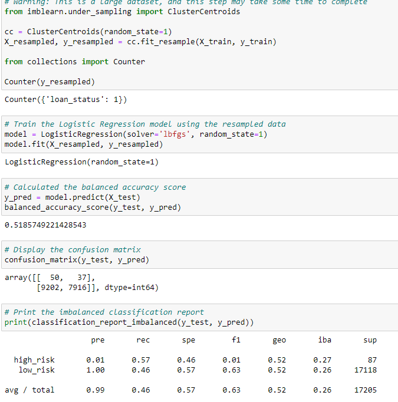

# Cryptocurrencies
A peer-to-peer lending services company wants to use machine learning to predict credit risk. Management believes that this will provide a quicker and more reliable loan experience. It also believes that machine learning will lead to a more accurate identification of good candidates for loans which will lead to lower default rates. The company wants me to assist the lead Data Scientist in implementing this plan. In my role, I will build and evaluate several machine learning models or algorithms to predict credit risk. I’ll use techniques such as resampling and boosting to make the most of my models and my data. Once I’d designed and implemented these algo rhythms, I will evaluate their performance and see how well my models predict data. Using the credit card credit dataset from LendingClub, a peer-to-peer lending services company, I’ll oversample the data using the RandomOverSampler and SMOTE algorithms, and undersample the data using the ClusterCentroids algorithm. Then,I’ll use a combinatorial approach of over- and undersampling using the SMOTEENN algorithm. Next, I’ll compare two new machine learning models that reduce bias, BalancedRandomForestClassifier and EasyEnsembleClassifier, to predict credit risk. Once I am done, I’ll evaluate the performance of these models and make a written recommendation on whether they should be used to predict credit risk.

